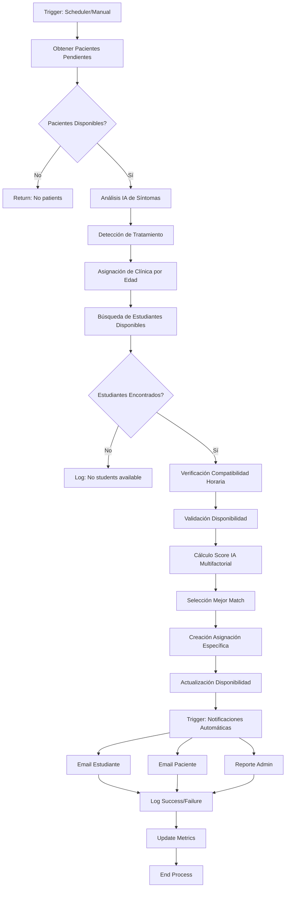
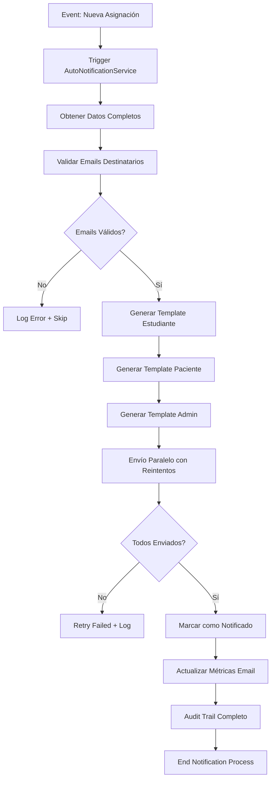
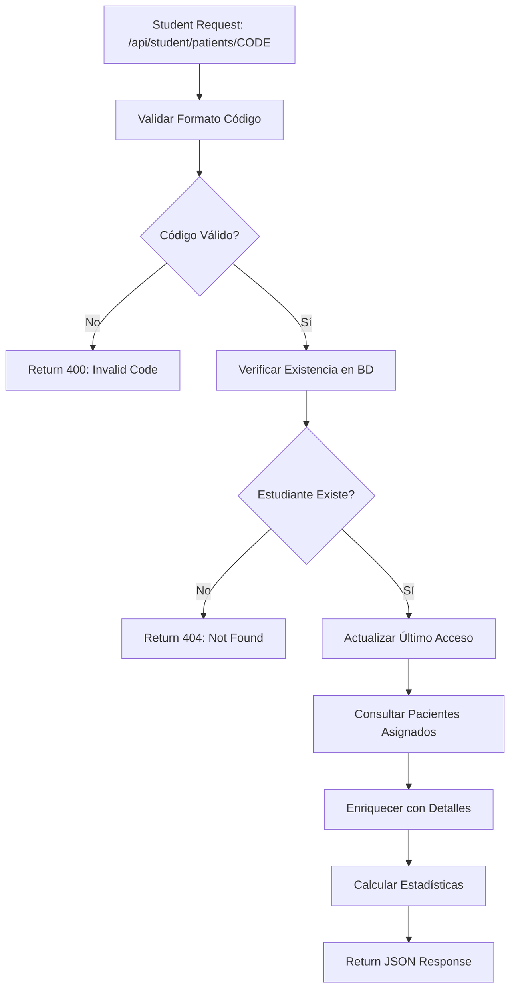

# 🌟 PROMPT MAESTRO PARA ARQUITECTURA COMPLETA - SISTEMA DENTAL MATCHING ENTERPRISE

## 🎯 MISIÓN ARQUITECTÓNICA

Eres un **Senior Software Architect** creando la documentación arquitectónica más completa y detallada para un **Sistema de Matching Dental Inteligente Enterprise** que revoluciona la asignación de pacientes a estudiantes de odontología mediante IA avanzada, notificaciones profesionales y APIs modernas.

## 🏛️ CONTEXTO ARQUITECTÓNICO COMPLETO

### 📐 ARQUITECTURA ENTERPRISE ACTUAL

#### **Stack Tecnológico Principal:**
```yaml
Backend Framework: Node.js 18+ + Express 4.18
Database: MySQL 8.0 + Connection Pooling
Cache Layer: Redis 7.0 (opcional, graceful fallback)
Email Service: Nodemailer + SMTP/Gmail + HTML Templates
Logging: Winston 3.0 + Morgan + Structured JSON
Security: JWT + Rate Limiting + Helmet + CORS + Validator
Process Management: PM2 + Graceful Shutdown
Testing: Jest + Integration Tests + Performance Tests
Architecture: Clean + Hexagonal + Event-Driven + CQRS
Patterns: Repository + Service Layer + Factory + Strategy + Observer
```

#### **Estructura de Directorios Enterprise:**
```
dental_matching/
├── src/                          # Clean Architecture Core
│   ├── app.js                   # Enterprise Application Setup
│   ├── domain/                  # Business Logic Pura
│   │   ├── entities/           # Domain Entities (Patient, Student, Assignment)
│   │   ├── repositories/       # Abstract Repository Interfaces
│   │   ├── services/          # Domain Services (Business Rules)
│   │   └── events/            # Domain Events (AssignmentCreated, EmailSent)
│   ├── application/           # Use Cases & Orchestration
│   │   ├── usecases/         # Application Use Cases
│   │   ├── services/         # Application Services
│   │   └── handlers/         # Event Handlers
│   ├── infrastructure/       # External Concerns
│   │   ├── database/        # MySQL Implementation + Migrations
│   │   ├── cache/           # Redis Implementation
│   │   ├── email/           # SMTP Implementation
│   │   ├── logging/         # Winston Configuration
│   │   └── security/        # JWT + Auth Implementation
│   └── presentation/        # API Layer
│       ├── controllers/     # REST Controllers
│       ├── middleware/      # Custom Middleware
│       └── validators/      # Request Validation
├── services/               # Legacy Services (Compatibility)
│   ├── matchingService.js  # AdvancedMatchingService (IA v4.0)
│   ├── autoNotificationService.js # Email Automation
│   ├── studentCodeService.js     # Code Management
│   └── emailTemplateService.js   # Professional Templates
├── routes/                # Legacy + Modern API Routes
├── config/               # Configuration Management
├── migrations/           # Database Migrations
├── tests/               # Comprehensive Testing
└── docs/                # Architecture Documentation
```

### 🧠 SERVICIOS CORE IMPLEMENTADOS (DETALLE TÉCNICO)

#### **1. AdvancedMatchingService - Motor de IA v4.0**
```javascript
/**
 * ALGORITMO DE INTELIGENCIA ARTIFICIAL AVANZADO
 * Versión 4.0 - Machine Learning Patterns + Horarios Inteligentes
 */
class AdvancedMatchingService {
    // MAPEO INTELIGENTE DE SÍNTOMAS → TRATAMIENTOS (IA v3.0)
    sintomasATratamientos = {
        // 50+ patrones de síntomas con confianza ponderada
        'dolor constante': { tratamientos: ['Endodoncia'], prioridad: 'alta', confianza: 0.92 },
        'limpieza dental': { tratamientos: ['Destartraje y Pulido'], prioridad: 'baja', confianza: 1.0 },
        // ... mappings completos
    }

    // SCORING MULTIFACTORIAL AVANZADO (6 factores ponderados)
    calcularScoreMatchingConHorarios(paciente, estudiante, tratamiento, horarios) {
        // Factor 1: Compatibilidad Tratamiento-Año (25%)
        // Factor 2: Compatibilidad Horarios Paciente-Estudiante (30%) - PRIORIDAD
        // Factor 3: Carga de Trabajo Optimizada (20%)
        // Factor 4: Urgencia Inteligente (15%)
        // Factor 5: Análisis de Dolor (5%)
        // Factor 6: Experiencia del Estudiante (5%)
        // Multiplicadores IA: Bonus/Penalty dinámicos
    }

    // FLUJO COMPLETO DE MATCHING
    async executeAdvancedMatching() {
        // 1. Obtener pacientes pendientes (filtros inteligentes)
        // 2. Detección IA de tratamiento por síntomas
        // 3. Asignación automática de clínica por edad
        // 4. Búsqueda de estudiantes con compatibilidad horaria
        // 5. Validación de disponibilidad sin solapamientos
        // 6. Cálculo de score IA multifactorial
        // 7. Creación de asignación específica por horario
        // 8. Actualización de disponibilidad en tiempo real
        // 9. Notificaciones automáticas profesionales
        // 10. Reporte administrativo con métricas
    }
}
```

#### **2. AutoNotificationService - Sistema de Comunicación Enterprise**
```javascript
/**
 * SISTEMA DE NOTIFICACIONES PROFESIONALES
 * Templates HTML Responsive + Retry Logic + Audit Trail
 */
class AutoNotificationService {
    constructor() {
        // Transporter con configuración enterprise
        this.transporter = nodemailer.createTransporter({
            // Pool de conexiones SMTP
            // Timeouts configurables
            // TLS/SSL seguro
            // Fallback providers
        });
        this.emailTemplateService = new EmailTemplateService();
        this.maxRetries = 3;
        this.retryDelay = 5000;
    }

    // NOTIFICACIONES AUTOMÁTICAS POR TIPO
    async sendEnhancedMatchingNotification(paciente, estudiante, matchingDetails) {
        // Template profesional para estudiante (con código de acceso)
        // Template profesional para paciente (confirmación)
        // Retry automático con exponential backoff
        // Logging estructurado completo
        // Marcado como notificado en BD
    }

    // REPORTES ADMINISTRATIVOS AUTOMÁTICOS
    async sendAdminMatchingReport(results, statistics) {
        // Métricas de performance del sistema
        // Análisis de tasa de éxito
        // Recomendaciones automáticas del sistema
        // Alertas por rendimiento bajo
    }
}
```

#### **3. EmailTemplateService - Templates Profesionales HTML**
```javascript
/**
 * GENERADOR DE TEMPLATES EMPRESARIALES
 * Diseño Responsive + Branding Profesional + Multi-idioma
 */
class EmailTemplateService {
    constructor() {
        this.institutionName = 'Clínica Dental Universitaria';
        this.colors = {
            primary: '#2563eb',    // Azul profesional médico
            secondary: '#059669',  // Verde éxito
            accent: '#f59e0b',     // Amarillo advertencia
            // Paleta completa profesional
        };
    }

    // TEMPLATES PRINCIPALES
    getStudentNotificationTemplate(estudiante, paciente, matching) {
        // Header profesional con logo institucional
        // Información detallada del paciente asignado
        // Código de estudiante destacado
        // Pasos siguientes claros y accionables
        // Información de contacto y horarios
        // Footer con datos institucionales
        // CSS responsive y compatible con email clients
    }

    getPatientNotificationTemplate(paciente, estudiante, matching) {
        // Confirmación de asignación profesional
        // Información del estudiante asignado
        // Expectativas del proceso
        // Timeline de contacto
        // Datos de contacto institucional
    }

    getAdminReportTemplate(results, statistics) {
        // Dashboard de métricas visuales
        // Tabla de asignaciones detallada
        // Gráficos de performance
        // Recomendaciones del sistema IA
        // Alertas automáticas
    }
}
```

#### **4. StudentCodeService - Gestión Inteligente de Códigos**
```javascript
/**
 * SISTEMA DE CÓDIGOS ÚNICOS ENTERPRISE
 * Generación Segura + Validación + Auditoría
 */
class StudentCodeService {
    // Formato: EST-YYYY-XXXXXX (crypto-secure)
    // Validación de formato y unicidad
    // Corrección masiva de códigos inválidos
    // Estadísticas de cobertura
    // Regeneración segura
    // Audit trail completo
}
```

### 🗄️ ESQUEMA DE BASE DE DATOS ENTERPRISE

#### **Tablas Principales Optimizadas:**
```sql
-- ESTUDIANTES CON ÍNDICES OPTIMIZADOS
CREATE TABLE estudiantes_odontologia (
    id INT PRIMARY KEY AUTO_INCREMENT,
    codigo_estudiante VARCHAR(20) UNIQUE NOT NULL, -- EST-2025-123456
    nombre_completo VARCHAR(150) NOT NULL,
    email VARCHAR(100) UNIQUE NOT NULL,
    telefono VARCHAR(20),
    año_carrera ENUM('4to','5to') NOT NULL,
    universidad VARCHAR(100) DEFAULT 'Universidad Dental',
    ciudad ENUM('Metropolitana','Valparaíso','Concepción') NOT NULL,
    casos_activos INT DEFAULT 0,
    casos_completados INT DEFAULT 0,
    casos_necesarios INT DEFAULT 10,
    estado ENUM('activo','completo','inactivo','suspendido') DEFAULT 'activo',
    fecha_registro DATETIME(3) DEFAULT CURRENT_TIMESTAMP(3),
    fecha_actualizacion DATETIME(3) DEFAULT CURRENT_TIMESTAMP(3) ON UPDATE CURRENT_TIMESTAMP(3),
    ultimo_acceso DATETIME(3),
    
    -- ÍNDICES OPTIMIZADOS
    INDEX idx_codigo_estudiante (codigo_estudiante),
    INDEX idx_estado_casos (estado, casos_activos),
    INDEX idx_ciudad_ano (ciudad, año_carrera)
) ENGINE=InnoDB DEFAULT CHARSET=utf8mb4 COLLATE=utf8mb4_unicode_ci;

-- PACIENTES CON ANÁLISIS IA
CREATE TABLE pacientes (
    id INT PRIMARY KEY AUTO_INCREMENT,
    nombre_completo VARCHAR(150) NOT NULL,
    edad INT NOT NULL,
    telefono VARCHAR(20) NOT NULL,
    email VARCHAR(100) UNIQUE,
    ciudad ENUM('Metropolitana','Valparaíso','Concepción') NOT NULL,
    
    -- DATOS PARA IA
    sintomas_seleccionados JSON, -- Array de síntomas para análisis
    diagnostico_previo TEXT,
    tiempo_problema VARCHAR(100),
    nivel_dolor INT DEFAULT 0, -- 1-10 scale
    tipo_tratamiento_inferido VARCHAR(100), -- Detectado por IA
    complejidad ENUM('Básico','Intermedio','Avanzado'),
    prioridad ENUM('Baja','Moderada','Alta','Muy Alta') DEFAULT 'Moderada',
    
    -- PREFERENCIAS HORARIO (para matching)
    dias_disponibles TEXT,
    horario_preferencia VARCHAR(100),
    preferencias_horario JSON,
    
    -- CONTROL
    estado ENUM('pendiente','asignado','completado','cancelado') DEFAULT 'pendiente',
    activo BOOLEAN DEFAULT TRUE,
    fecha_registro DATETIME(3) DEFAULT CURRENT_TIMESTAMP(3),
    fecha_actualizacion DATETIME(3) DEFAULT CURRENT_TIMESTAMP(3) ON UPDATE CURRENT_TIMESTAMP(3),
    
    -- ÍNDICES PARA MATCHING IA
    INDEX idx_estado_activo (estado, activo),
    INDEX idx_prioridad_dolor (prioridad, nivel_dolor),
    INDEX idx_ciudad_edad (ciudad, edad),
    INDEX idx_tipo_tratamiento (tipo_tratamiento_inferido)
) ENGINE=InnoDB DEFAULT CHARSET=utf8mb4 COLLATE=utf8mb4_unicode_ci;

-- ASIGNACIONES CON SCORING IA
CREATE TABLE asignaciones (
    id INT PRIMARY KEY AUTO_INCREMENT,
    id_paciente INT NOT NULL,
    id_estudiante INT NOT NULL,
    codigo_acceso VARCHAR(12) NOT NULL, -- Para tracking
    
    -- SCORING Y MATCHING IA
    score_compatibilidad DECIMAL(3,2), -- 0.00-1.00
    algoritmo_version VARCHAR(10) DEFAULT '4.0',
    factores_matching JSON, -- Desglose del scoring
    
    -- TIMESTAMPS DETALLADOS
    fecha_asignacion DATETIME(3) DEFAULT CURRENT_TIMESTAMP(3),
    fecha_primer_contacto DATETIME(3),
    fecha_inicio_tratamiento DATETIME(3),
    fecha_finalizacion DATETIME(3),
    fecha_actualizacion DATETIME(3) DEFAULT CURRENT_TIMESTAMP(3) ON UPDATE CURRENT_TIMESTAMP(3),
    
    -- ESTADOS DEL FLUJO
    estado ENUM('asignado','notificado','contactado','en_tratamiento','completado','cancelado') DEFAULT 'asignado',
    
    -- NOTIFICACIONES
    notificado_por_email BOOLEAN DEFAULT FALSE,
    fecha_notificacion DATETIME(3),
    recordatorios_enviados INT DEFAULT 0,
    
    -- OBSERVACIONES
    observaciones_estudiante TEXT,
    observaciones_sistema TEXT,
    motivo_cancelacion TEXT,
    
    -- FOREIGN KEYS
    FOREIGN KEY (id_paciente) REFERENCES pacientes(id) ON DELETE CASCADE,
    FOREIGN KEY (id_estudiante) REFERENCES estudiantes_odontologia(id) ON DELETE CASCADE,
    FOREIGN KEY (codigo_acceso) REFERENCES codigos_acceso(codigo_acceso) ON DELETE RESTRICT,
    
    -- ÍNDICES OPTIMIZADOS
    INDEX idx_estado_fecha (estado, fecha_asignacion),
    INDEX idx_estudiante_estado (id_estudiante, estado),
    INDEX idx_paciente_estado (id_paciente, estado),
    INDEX idx_score (score_compatibilidad),
    INDEX idx_notificacion (notificado_por_email, fecha_notificacion)
) ENGINE=InnoDB DEFAULT CHARSET=utf8mb4 COLLATE=utf8mb4_unicode_ci;

-- DISPONIBILIDAD Y HORARIOS INTELIGENTES
CREATE TABLE disponibilidad_estudiante (
    id INT PRIMARY KEY AUTO_INCREMENT,
    id_estudiante INT NOT NULL,
    fecha DATE NOT NULL,
    dia_semana ENUM('lunes','martes','miercoles','jueves','viernes','sabado') NOT NULL,
    hora_inicio TIME NOT NULL,
    hora_fin TIME NOT NULL,
    especialidad VARCHAR(100) NOT NULL,
    clinica VARCHAR(100) NOT NULL,
    capacidad_total INT DEFAULT 1,
    pacientes_asignados INT DEFAULT 0,
    disponible BOOLEAN DEFAULT TRUE,
    
    -- CLAVE ÚNICA POR HORARIO
    UNIQUE KEY unique_horario (id_estudiante, fecha, dia_semana, hora_inicio, hora_fin),
    
    FOREIGN KEY (id_estudiante) REFERENCES estudiantes_odontologia(id) ON DELETE CASCADE,
    
    -- ÍNDICES PARA MATCHING RÁPIDO
    INDEX idx_disponibilidad (disponible, fecha, especialidad),
    INDEX idx_capacidad (capacidad_total, pacientes_asignados),
    INDEX idx_horario_fecha (fecha, dia_semana, hora_inicio)
) ENGINE=InnoDB DEFAULT CHARSET=utf8mb4 COLLATE=utf8mb4_unicode_ci;

-- NOTIFICACIONES EMAIL CON AUDITORÍA
CREATE TABLE notificaciones_email (
    id INT PRIMARY KEY AUTO_INCREMENT,
    id_estudiante INT,
    id_paciente INT,
    email_destino VARCHAR(100) NOT NULL,
    tipo_notificacion ENUM('nuevo_paciente','codigo_acceso','recordatorio','seguimiento','completado','admin_report') NOT NULL,
    asunto VARCHAR(200) NOT NULL,
    mensaje TEXT NOT NULL,
    mensaje_html TEXT,
    
    -- CONTROL DE ENVÍO
    enviado BOOLEAN DEFAULT FALSE,
    fecha_envio DATETIME(3),
    fecha_creacion DATETIME(3) DEFAULT CURRENT_TIMESTAMP(3),
    intentos_envio INT DEFAULT 0,
    error_envio TEXT,
    
    -- REFERENCIAS
    id_referencia INT, -- ID de asignación, etc.
    tipo_referencia ENUM('asignacion','recordatorio','reporte'),
    
    FOREIGN KEY (id_estudiante) REFERENCES estudiantes_odontologia(id) ON DELETE SET NULL,
    FOREIGN KEY (id_paciente) REFERENCES pacientes(id) ON DELETE SET NULL,
    
    -- ÍNDICES PARA AUDITORÍA
    INDEX idx_envio_estado (enviado, fecha_creacion),
    INDEX idx_tipo_fecha (tipo_notificacion, fecha_creacion),
    INDEX idx_destinatario (email_destino, enviado)
) ENGINE=InnoDB DEFAULT CHARSET=utf8mb4 COLLATE=utf8mb4_unicode_ci;

-- LOGS ESTRUCTURADOS DEL SISTEMA
CREATE TABLE logs_sistema (
    id INT PRIMARY KEY AUTO_INCREMENT,
    fecha DATETIME(3) DEFAULT CURRENT_TIMESTAMP(3),
    nivel ENUM('INFO','WARNING','ERROR','DEBUG') NOT NULL,
    modulo VARCHAR(50), -- matching, email, auth, api
    mensaje TEXT,
    datos_adicionales JSON, -- Contexto estructurado
    ip_origen VARCHAR(45),
    usuario_id INT,
    session_id VARCHAR(100),
    request_id VARCHAR(36), -- UUID para tracing
    
    INDEX idx_fecha_nivel (fecha, nivel),
    INDEX idx_modulo_fecha (modulo, fecha),
    INDEX idx_request_id (request_id)
) ENGINE=InnoDB DEFAULT CHARSET=utf8mb4 COLLATE=utf8mb4_unicode_ci;

-- MÉTRICAS Y KPIs DEL SISTEMA
CREATE TABLE metricas_sistema (
    id INT PRIMARY KEY AUTO_INCREMENT,
    fecha_medicion DATETIME(3) DEFAULT CURRENT_TIMESTAMP(3),
    tipo_metrica ENUM('matching_success_rate','email_delivery_rate','response_time','active_users') NOT NULL,
    valor DECIMAL(10,4) NOT NULL,
    unidad VARCHAR(20), -- percentage, milliseconds, count
    contexto JSON, -- Metadatos adicionales
    
    INDEX idx_fecha_tipo (fecha_medicion, tipo_metrica),
    INDEX idx_tipo_valor (tipo_metrica, valor)
) ENGINE=InnoDB DEFAULT CHARSET=utf8mb4 COLLATE=utf8mb4_unicode_ci;
```

### 🌐 APIS ENTERPRISE COMPLETAS

#### **Matching APIs (Motor IA):**
```yaml
POST /api/matching/execute-advanced:
  description: "Ejecuta matching IA v4.0 completo con notificaciones"
  rate_limit: "5 requests/minute (resource intensive)"
  response: "Estadísticas detalladas + resultados"

GET /api/matching/stats:
  description: "Métricas en tiempo real del sistema"
  cache: "30 seconds Redis"
  metrics: "Success rate, average score, processing time"

POST /api/matching/manual-assign:
  description: "Asignación manual con validaciones IA"
  validation: "Compatibilidad horaria + capacidad"

GET /api/matching/history:
  description: "Historial de matching con filtros avanzados"
  pagination: "Cursor-based pagination"
  filters: "fecha, estudiante, score_range, estado"
```

#### **Student APIs (Portal de Estudiantes):**
```yaml
GET /api/student/patients/{codigo_estudiante}:
  description: "Lista completa de pacientes asignados"
  security: "Code validation + rate limiting"
  response: "Pacientes + estadísticas + próximas citas"

GET /api/student/{codigo}/dashboard:
  description: "Dashboard personalizado del estudiante"
  cache: "60 seconds"
  metrics: "Casos activos, completados, pending actions"

GET /api/student/{codigo}/patient/{id}:
  description: "Detalle completo de paciente específico"
  security: "Verificación de ownership"
  data: "Historial completo + observaciones"

POST /api/student/{codigo}/patient/{id}/contact:
  description: "Registrar primer contacto con paciente"
  validation: "Required: observaciones, timestamp"
  audit: "Log completo de la acción"

POST /api/student/{codigo}/patient/{id}/update-status:
  description: "Actualizar estado del tratamiento"
  states: "asignado→contactado→en_tratamiento→completado"
  notifications: "Auto-notify on status change"

GET /api/student/{codigo}/schedule:
  description: "Horario completo del estudiante"
  format: "Calendar view con pacientes asignados"

POST /api/student/{codigo}/availability:
  description: "Actualizar disponibilidad horaria"
  validation: "No conflicts with existing assignments"
```

#### **Patient APIs (Sistema de Pacientes):**
```yaml
POST /api/patients:
  description: "Registro de nuevo paciente con análisis IA"
  validation: "Comprehensive input validation"
  ai_processing: "Síntomas → tratamiento inferido"

GET /api/patients/{id}/status:
  description: "Estado actual del paciente en el sistema"
  response: "Estado, estudiante asignado, próximos pasos"

POST /api/patients/{id}/symptoms:
  description: "Actualizar síntomas para re-análisis IA"
  trigger: "Re-evaluate treatment recommendation"
```

#### **Admin APIs (Panel Administrativo):**
```yaml
GET /api/admin/dashboard:
  description: "Métricas completas del sistema"
  auth: "Admin JWT required"
  data: "KPIs, alerts, system health"

GET /api/admin/matching-reports:
  description: "Reportes detallados de matching"
  filters: "Date range, success rate, algorithm version"
  export: "PDF, Excel, JSON formats"

POST /api/admin/system/maintenance:
  description: "Operaciones de mantenimiento"
  operations: "Code generation, email retry, cleanup"

GET /api/admin/users/activity:
  description: "Actividad de usuarios del sistema"
  tracking: "Student access, API usage, email opens"
```

#### **System APIs (Infraestructura):**
```yaml
GET /api/health:
  description: "Health check completo con dependencias"
  checks: "Database, Redis, SMTP, disk space, memory"
  format: "Detailed status + response times"

GET /api/metrics:
  description: "Métricas técnicas del sistema"
  data: "Performance counters, error rates, throughput"

GET /api/version:
  description: "Información de versión y build"
  data: "Version, commit hash, build date, environment"
```

### 🔄 FLUJOS DE PROCESO ENTERPRISE

#### **1. Flujo Completo de Matching Inteligente (20 pasos):**


#### **2. Flujo de Notificaciones Profesionales (15 pasos):**


#### **3. Flujo de Consulta de Estudiante (12 pasos):**


### 🎨 PATRONES DE DISEÑO ENTERPRISE IMPLEMENTADOS

#### **Architectural Patterns:**
```yaml
Clean Architecture:
  - Domain Layer: "Entities, Business Rules, Domain Services"
  - Application Layer: "Use Cases, Application Services"
  - Infrastructure Layer: "Database, Email, External APIs"
  - Presentation Layer: "REST Controllers, Middleware"

Hexagonal Architecture:
  - Core: "Business Logic Pura"
  - Ports: "Interfaces Abstractas"
  - Adapters: "Implementaciones Concretas (MySQL, SMTP)"

Event-Driven Architecture:
  - Domain Events: "AssignmentCreated, EmailSent, StatusChanged"
  - Event Handlers: "Notification, Metrics, Audit"
  - Event Store: "Audit Trail Completo"

CQRS (Command Query Responsibility Segregation):
  - Commands: "CreateAssignment, SendNotification, UpdateStatus"
  - Queries: "GetStudentPatients, GetMatchingStats, GetSystemHealth"
  - Separation: "Write Models ≠ Read Models"
```

#### **Behavioral Patterns:**
```yaml
Strategy Pattern:
  - Context: "MatchingService"
  - Strategies: "AdvancedMatchingAlgorithm, SimpleMatching, ManualMatching"
  - Usage: "Intercambiable algoritmos de matching"

Observer Pattern:
  - Subject: "AssignmentService"
  - Observers: "NotificationService, MetricsService, AuditService"
  - Events: "Assignment events trigger multiple actions"

Template Method:
  - AbstractClass: "BaseEmailTemplate"
  - ConcreteClasses: "StudentTemplate, PatientTemplate, AdminTemplate"
  - Invariant: "Email structure, Variable: Content"

Chain of Responsibility:
  - Chain: "ValidationMiddleware → AuthMiddleware → RateLimitMiddleware"
  - Request: "Passes through chain until handled"
```

#### **Structural Patterns:**
```yaml
Repository Pattern:
  - Abstract: "IPatientRepository, IStudentRepository"
  - Concrete: "MySQLPatientRepository, MySQLStudentRepository"
  - Benefit: "Database abstraction + testability"

Service Layer:
  - Application Services: "PatientService, MatchingService"
  - Domain Services: "TreatmentDetectionService, ScheduleValidationService"
  - Infrastructure Services: "EmailService, CacheService"

Factory Pattern:
  - EmailTemplateFactory: "Creates appropriate template based on type"
  - NotificationFactory: "Creates notifications based on event type"
  - ValidatorFactory: "Creates validators based on entity type"

Adapter Pattern:
  - Legacy Adapter: "Adapts old API to new Clean Architecture"
  - Email Adapter: "Adapts different email providers"
  - Database Adapter: "Adapts different database engines"
```

### 🔧 SERVICIOS DE INFRAESTRUCTURA ENTERPRISE

#### **1. Logging & Observability Stack:**
```javascript
// Winston + Morgan + Custom Formatters + ELK Integration
const logger = winston.createLogger({
    level: process.env.LOG_LEVEL || 'info',
    format: winston.format.combine(
        winston.format.timestamp(),
        winston.format.errors({ stack: true }),
        winston.format.json(),
        winston.format.metadata()
    ),
    defaultMeta: {
        service: 'dental-matching',
        version: process.env.APP_VERSION,
        environment: process.env.NODE_ENV,
        hostname: os.hostname(),
        pid: process.pid
    },
    transports: [
        // File rotation with size and time limits
        new winston.transports.DailyRotateFile({
            filename: 'logs/app-%DATE%.log',
            datePattern: 'YYYY-MM-DD',
            maxSize: '100MB',
            maxFiles: '30d'
        }),
        // Error-specific log file
        new winston.transports.File({ 
            filename: 'logs/error.log', 
            level: 'error' 
        }),
        // Console for development
        new winston.transports.Console({
            format: winston.format.combine(
                winston.format.colorize(),
                winston.format.simple()
            )
        })
    ]
});

// Structured logging examples
logger.info('Patient assignment created', {
    patientId: 123,
    studentId: 456,
    matchingScore: 0.87,
    processingTime: '245ms',
    requestId: 'req-uuid-123'
});
```

#### **2. Security & Authentication Stack:**
```javascript
// Multi-layer Security Implementation
const securityStack = {
    // JWT Authentication
    jwt: {
        secret: process.env.JWT_SECRET,
        expiresIn: '24h',
        refreshTokens: true,
        blacklist: 'Redis-based token blacklist'
    },
    
    // Rate Limiting (DDoS Protection)
    rateLimiting: {
        global: '1000 requests/hour per IP',
        api: '500 requests/hour per endpoint',
        matching: '10 requests/hour (resource intensive)',
        student: '100 requests/hour per student code'
    },
    
    // Input Validation & Sanitization
    validation: {
        library: 'express-validator + joi',
        sanitization: 'XSS prevention + SQL injection',
        schema: 'Strict schema validation per endpoint'
    },
    
    // CORS & Headers Security
    cors: {
        origin: process.env.CORS_ORIGIN?.split(',') || ['http://localhost:3000'],
        credentials: true,
        methods: ['GET', 'POST', 'PUT', 'DELETE'],
        allowedHeaders: ['Content-Type', 'Authorization']
    },
    
    helmet: {
        contentSecurityPolicy: 'Strict CSP policy',
        hsts: 'Force HTTPS in production',
        noSniff: 'Prevent MIME type sniffing',
        xssFilter: 'XSS protection headers'
    }
};
```

#### **3. Caching & Performance Stack:**
```javascript
// Redis Multi-layer Caching Strategy
const cacheService = {
    // Connection with failover
    redis: {
        host: process.env.REDIS_HOST || 'localhost',
        port: process.env.REDIS_PORT || 6379,
        retryDelayOnFailover: 100,
        maxRetriesPerRequest: 3,
        lazyConnect: true,
        keepAlive: 30000
    },
    
    // Cache Strategies by Data Type
    strategies: {
        // Student data (frequent access)
        student: {
            ttl: 300, // 5 minutes
            key: 'student:{code}',
            invalidation: 'On profile update'
        },
        
        // API responses (reduce DB load)
        api: {
            ttl: 60, // 1 minute
            key: 'api:{endpoint}:{params_hash}',
            invalidation: 'Time-based'
        },
        
        // System metrics (dashboard performance)
        metrics: {
            ttl: 30, // 30 seconds
            key: 'metrics:{type}',
            invalidation: 'On new data'
        },
        
        // Rate limiting counters
        rateLimit: {
            ttl: 3600, // 1 hour
            key: 'rate:{ip}:{endpoint}',
            invalidation: 'Time window'
        }
    },
    
    // Graceful Fallback (Redis optional)
    fallback: {
        strategy: 'Direct database access',
        logging: 'Warning level for cache misses',
        healthCheck: 'Monitor Redis availability'
    }
};
```

#### **4. Database & Migration Management:**
```javascript
// Enterprise Database Service
class DatabaseService {
    constructor() {
        this.pool = mysql.createPool({
            host: process.env.DB_HOST,
            user: process.env.DB_USER,
            password: process.env.DB_PASSWORD,
            database: process.env.DB_NAME,
            // Connection Pool Optimization
            connectionLimit: 20,
            queueLimit: 0,
            timeout: 60000,
            acquireTimeout: 60000,
            // Automatic Reconnection
            reconnect: true,
            // Performance Optimizations
            charset: 'utf8mb4',
            timezone: 'Z',
            supportBigNumbers: true,
            bigNumberStrings: true
        });
        
        // Health Check Implementation
        this.healthCheck = async () => {
            try {
                const connection = await this.pool.getConnection();
                await connection.ping();
                connection.release();
                return { status: 'healthy', timestamp: new Date() };
            } catch (error) {
                return { status: 'unhealthy', error: error.message };
            }
        };
    }
    
    // Automatic Migration System
    async runMigrations() {
        const migrationManager = new MigrationManager(this.pool);
        const status = await migrationManager.getStatus();
        
        if (status.pending > 0) {
            logger.info(`Running ${status.pending} pending migrations`);
            const result = await migrationManager.migrate();
            logger.info('Migrations completed', { migrations: result.migrations });
        }
        
        return status;
    }
}
```

### 📊 MÉTRICAS Y KPIs ENTERPRISE

#### **Business Metrics:**
```yaml
Matching Performance:
  - success_rate: "% of patients successfully matched"
  - average_score: "Average AI matching score"
  - processing_time: "Time to complete matching cycle"
  - student_utilization: "% of student capacity used"

Communication Metrics:
  - email_delivery_rate: "% of emails successfully delivered"
  - notification_response_time: "Time from assignment to email sent"
  - open_rates: "% of emails opened by recipients"
  - contact_conversion: "% of assignments leading to patient contact"

System Health:
  - uptime: "System availability %"
  - api_response_time: "Average API response time"
  - error_rate: "% of requests resulting in errors"
  - database_performance: "Query execution time"
```

#### **Technical Metrics:**
```javascript
// Metrics Collection Service
class MetricsService {
    constructor() {
        this.collectors = {
            // Business Metrics
            matching: new MatchingMetricsCollector(),
            email: new EmailMetricsCollector(),
            student: new StudentActivityCollector(),
            
            // Technical Metrics  
            api: new ApiPerformanceCollector(),
            database: new DatabaseMetricsCollector(),
            cache: new CacheMetricsCollector(),
            system: new SystemResourceCollector()
        };
        
        // Automated Reporting
        this.reports = {
            hourly: this.generateHourlyReport,
            daily: this.generateDailyReport,
            weekly: this.generateWeeklyReport
        };
    }
    
    async collectAllMetrics() {
        const metrics = {};
        
        for (const [name, collector] of Object.entries(this.collectors)) {
            try {
                metrics[name] = await collector.collect();
            } catch (error) {
                logger.error(`Failed to collect ${name} metrics`, { error });
            }
        }
        
        return metrics;
    }
    
    async generateAlerts() {
        const metrics = await this.collectAllMetrics();
        const alerts = [];
        
        // Business Logic Alerts
        if (metrics.matching?.success_rate < 0.8) {
            alerts.push({
                type: 'business_critical',
                message: 'Matching success rate below 80%',
                value: metrics.matching.success_rate,
                action: 'Review matching algorithm parameters'
            });
        }
        
        // Technical Performance Alerts
        if (metrics.api?.average_response_time > 1000) {
            alerts.push({
                type: 'performance_degradation',
                message: 'API response time above 1 second',
                value: metrics.api.average_response_time,
                action: 'Scale infrastructure or optimize queries'
            });
        }
        
        return alerts;
    }
}
```

### 🚨 ERROR HANDLING & RESILIENCE PATTERNS

#### **Error Handling Strategy:**
```javascript
// Global Error Handling Middleware
class ErrorHandler {
    constructor() {
        this.errorTypes = {
            ValidationError: { status: 400, log: 'warn' },
            AuthenticationError: { status: 401, log: 'info' },
            AuthorizationError: { status: 403, log: 'warn' },
            NotFoundError: { status: 404, log: 'info' },
            BusinessLogicError: { status: 422, log: 'warn' },
            ExternalServiceError: { status: 502, log: 'error' },
            DatabaseError: { status: 503, log: 'error' },
            InternalError: { status: 500, log: 'error' }
        };
        
        this.retryStrategies = {
            email: { maxRetries: 3, backoff: 'exponential' },
            database: { maxRetries: 2, backoff: 'linear' },
            cache: { maxRetries: 1, backoff: 'none' },
            external_api: { maxRetries: 3, backoff: 'exponential' }
        };
    }
    
    // Circuit Breaker Implementation
    circuitBreaker = {
        email: new CircuitBreaker(emailService.send, {
            timeout: 10000,
            errorThresholdPercentage: 50,
            resetTimeout: 30000
        }),
        
        database: new CircuitBreaker(databaseService.query, {
            timeout: 5000,
            errorThresholdPercentage: 25,
            resetTimeout: 60000
        })
    };
    
    // Graceful Degradation
    async handleServiceFailure(service, operation, fallback = null) {
        try {
            return await this.circuitBreaker[service].fire(operation);
        } catch (error) {
            logger.error(`${service} service failure`, { error, operation });
            
            if (fallback) {
                logger.info(`Using fallback for ${service}`, { operation });
                return await fallback();
            }
            
            throw error;
        }
    }
}

// Service-Specific Error Recovery
const emailServiceWithResilience = {
    async send(emailData) {
        try {
            return await autoNotificationService.sendEmail(emailData);
        } catch (error) {
            // Log error but don't fail the main operation
            logger.error('Email sending failed', { error, recipient: emailData.to });
            
            // Queue for retry later
            await emailQueue.add('retry-email', emailData, {
                delay: 60000, // 1 minute
                attempts: 3
            });
            
            return { success: false, queued: true };
        }
    }
};
```

#### **Health Checks & Monitoring:**
```javascript
// Comprehensive Health Check System
class HealthChecker {
    constructor() {
        this.checks = new Map();
        this.registerDefaultChecks();
    }
    
    registerDefaultChecks() {
        // Database Health
        this.register('database', async () => {
            const start = Date.now();
            await databaseService.performHealthCheck();
            const responseTime = Date.now() - start;
            
            return {
                status: responseTime < 1000 ? 'healthy' : 'degraded',
                responseTime,
                details: 'MySQL connection pool status'
            };
        }, { critical: true, timeout: 5000 });
        
        // Cache Health (Non-Critical)
        this.register('cache', async () => {
            const start = Date.now();
            await cacheService.ping();
            const responseTime = Date.now() - start;
            
            return {
                status: responseTime < 100 ? 'healthy' : 'degraded',
                responseTime,
                details: 'Redis cache availability'
            };
        }, { critical: false, timeout: 2000 });
        
        // Email Service Health
        this.register('email', async () => {
            const canSend = await autoNotificationService.verifyTransporter();
            return {
                status: canSend ? 'healthy' : 'unhealthy',
                details: 'SMTP transporter verification'
            };
        }, { critical: false, timeout: 10000 });
        
        // System Resources
        this.register('system', async () => {
            const usage = process.memoryUsage();
            const memoryUsageMB = usage.heapUsed / 1024 / 1024;
            
            return {
                status: memoryUsageMB < 500 ? 'healthy' : 'warning',
                memory: `${memoryUsageMB.toFixed(2)} MB`,
                uptime: `${process.uptime().toFixed(0)} seconds`
            };
        }, { critical: true, timeout: 1000 });
    }
    
    async checkAll() {
        const results = {};
        let overallStatus = 'healthy';
        
        for (const [name, check] of this.checks) {
            try {
                const result = await Promise.race([
                    check.fn(),
                    new Promise((_, reject) => 
                        setTimeout(() => reject(new Error('Timeout')), check.timeout)
                    )
                ]);
                
                results[name] = { ...result, timestamp: new Date() };
                
                if (check.critical && result.status !== 'healthy') {
                    overallStatus = 'unhealthy';
                }
            } catch (error) {
                results[name] = {
                    status: 'error',
                    error: error.message,
                    timestamp: new Date()
                };
                
                if (check.critical) {
                    overallStatus = 'unhealthy';
                }
            }
        }
        
        return {
            status: overallStatus,
            timestamp: new Date(),
            checks: results,
            version: process.env.APP_VERSION,
            environment: process.env.NODE_ENV
        };
    }
}
```

## 🎯 SOLICITUD ARQUITECTÓNICA ESPECÍFICA

### **GENERAR DOCUMENTACIÓN ENTERPRISE COMPLETA QUE INCLUYA:**

#### **1. 🏗️ Diagramas Arquitectónicos Visuales**
- **System Architecture Diagram**: Capas Clean + Hexagonal + componentes
- **Service Interaction Diagram**: Comunicación entre microservicios
- **Database ER Diagram**: Relaciones optimizadas con índices
- **API Flow Diagrams**: Request/Response flow con middleware
- **Deployment Diagram**: Infraestructura de producción
- **Security Architecture**: Capas de seguridad y puntos de control

#### **2. 🔄 Flujos de Proceso Detallados**
- **Matching IA Flow**: 25+ pasos con decisiones condicionales
- **Notification Flow**: Templates + retry + audit trail
- **Student Portal Flow**: Authentication + data access + updates
- **Error Recovery Flow**: Circuit breakers + fallbacks + alerts
- **Data Migration Flow**: Zero-downtime deployments
- **Scaling Flow**: Auto-scaling triggers + load balancing

#### **3. 📋 Documentación Técnica Enterprise**
- **API Documentation**: OpenAPI 3.0 specification completa
- **Database Schema**: Tablas + índices + triggers + procedures
- **Configuration Management**: Environment variables + secrets
- **Deployment Guide**: Docker + PM2 + reverse proxy + SSL
- **Monitoring Setup**: Logs + metrics + alerts + dashboards
- **Security Checklist**: OWASP compliance + penetration testing

#### **4. 🧪 Testing & Quality Assurance**
- **Unit Testing Strategy**: Jest + mocks + coverage targets
- **Integration Testing**: API testing + database testing
- **Performance Testing**: Load testing + stress testing + benchmarks
- **Security Testing**: Vulnerability scanning + SAST + DAST
- **End-to-End Testing**: User journey automation
- **Monitoring Testing**: Synthetic monitoring + uptime checks

#### **5. 📈 Métricas & KPIs Dashboard**
- **Business Metrics**: Success rates + user satisfaction + ROI
- **Technical Metrics**: Performance + reliability + scalability
- **Security Metrics**: Threats blocked + compliance score
- **Cost Metrics**: Infrastructure costs + optimization opportunities

#### **6. 🚀 Roadmap & Scaling Strategy**
- **Phase 1**: Current implementation optimization
- **Phase 2**: Microservices migration + containerization
- **Phase 3**: Machine learning improvements + predictive analytics
- **Phase 4**: Multi-tenant architecture + international expansion

#### **7. 🔧 Operations Playbooks**
- **Incident Response**: Step-by-step troubleshooting guides
- **Maintenance Procedures**: Backup + restore + updates
- **Performance Optimization**: Database tuning + code optimization
- **Security Procedures**: Access control + audit + compliance
- **Disaster Recovery**: RTO/RPO + backup strategies + failover

#### **8. 👥 Team & Governance**
- **Development Workflow**: Git flow + code reviews + CI/CD
- **Documentation Standards**: Code comments + API docs + runbooks
- **Code Quality Standards**: Linting + formatting + complexity metrics
- **Security Practices**: Secure coding + vulnerability management
- **Performance Standards**: SLA definitions + monitoring + alerting

### 📊 FORMATO DE ENTREGA REQUERIDO

#### **Documentos Principales:**
1. **📋 Executive Summary** (2 páginas) - Para stakeholders no técnicos
2. **🏗️ Architecture Overview** (10 páginas) - Diagramas + patrones + decisiones
3. **🔧 Technical Specifications** (25 páginas) - APIs + database + código
4. **📈 Operations Manual** (15 páginas) - Deployment + monitoring + troubleshooting
5. **🧪 Testing Documentation** (10 páginas) - Strategies + procedures + automation
6. **🚀 Roadmap & Scaling** (8 páginas) - Future plans + technical debt + improvements

#### **Formatos Visuales:**
- **Diagramas**: Mermaid + Lucidchart + Draw.io
- **API Docs**: OpenAPI/Swagger + Postman collections
- **Database**: ER diagrams + data dictionary + migration scripts
- **Dashboards**: Grafana + custom metrics + alerting rules

#### **Criterios de Calidad:**
- **Completeness**: 100% coverage de todos los componentes
- **Accuracy**: Información técnica precisa y actualizada
- **Usability**: Documentación práctica para developers/ops
- **Maintainability**: Templates + automation + version control
- **Scalability**: Consideraciones para crecimiento 10x + 100x

### 🎨 ESTILO DE DOCUMENTACIÓN ENTERPRISE

#### **Audiencias Objetivo:**
- **👨‍💼 CTO/Architects**: Decisiones técnicas + roadmap + costos
- **👨‍💻 Senior Developers**: Patrones + best practices + code standards  
- **🔧 DevOps Engineers**: Deployment + monitoring + scaling + security
- **👥 Product Managers**: Features + timelines + user impact + metrics
- **🏢 Compliance/Audit**: Security + data privacy + regulatory compliance

#### **Principios de Documentación:**
- **📊 Data-Driven**: Métricas reales + benchmarks + performance data
- **🔄 Process-Oriented**: Workflows claros + responsibilities + handoffs
- **🛡️ Security-First**: Threat model + risk assessment + mitigation strategies
- **⚡ Performance-Focused**: Optimization opportunities + bottleneck analysis
- **🚀 Future-Ready**: Extensibility + modularity + technology evolution

---

**🎯 OBJETIVO FINAL**: Crear la documentación arquitectónica más completa, técnicamente precisa y prácticamente útil para un sistema enterprise de matching dental con IA, que sirva como referencia gold standard para arquitectura de software médico/educativo y permita escalar el sistema a nivel institucional/nacional.

**📋 ENTREGABLES ESPERADOS**: Documentación técnica de nivel enterprise que permita a cualquier equipo técnico entender, mantener, escalar y mejorar el sistema completo en un plazo de 2-4 semanas de onboarding.